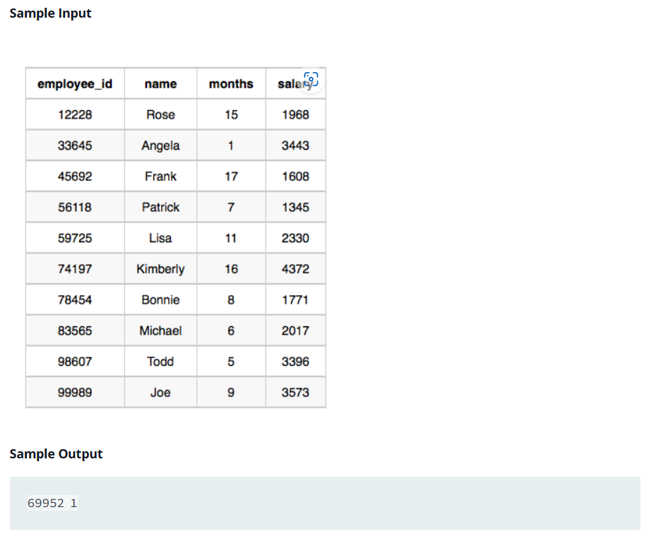
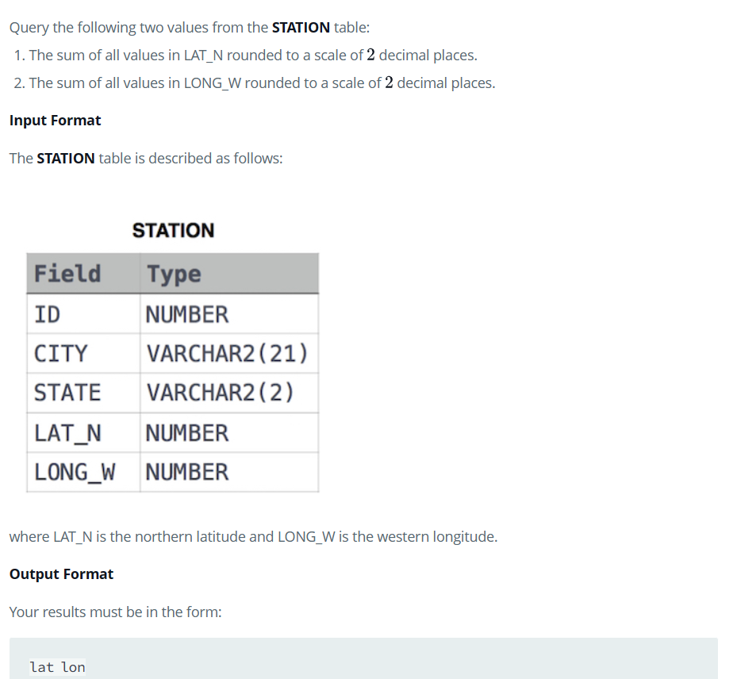
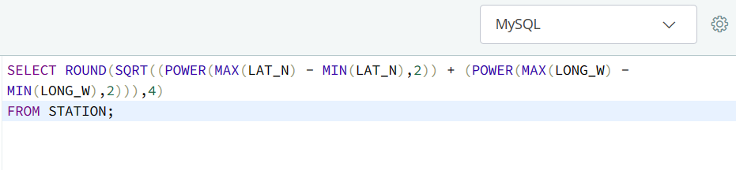

# HackerRank_SQL_Aggregation

## Purpose

This respository contains the solutions of all the Aggregation based SQL questions on HackerRank.

##Source

- HackerRank

## Aggregation Problems & Solutions

### Problem 1:

### Solution:

### Problem 2:

### Solution:

### Problem 3:

### Solution:

### Problem 4:

### Solution:

### Problem 5:

### Solution:

### Problem 6:

### Solution:

### Problem 7:

### Solution:

### Problem 8:

### Solution:

### Problem 9:

### Solution:

### Problem 10:

### Solution:

### Problem 11:

### Solution:

### Problem 12:

### Solution:

### Problem 13:

### Solution:

### Problem 14:

### Solution:

